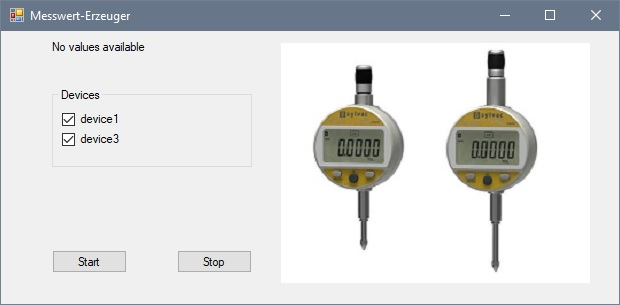

# MESSDATEN-SERVER

## Einleitung

Die folgenden Anweisungen dienen zur Installation und Ausführung folgender Projektteile:
 
* Messdaten-Server 

* Client zur Konfiguration der Devices 

* Simulation eines Messprogrammes

Der Messdaten-Server stellt Methoden zur Konfiguration der Devices zur Verfügung. 

Die aktuellen Messwerte der Devices werden bei einem Request aus der konfigurierten Data-Source gelesen.

Die Simulation beschreibt die Messung der Maschinen-Z-Achse durch zwei Messuhren in X- und in Y-Richtung. 

Der Ablauf simuliert die Bewegung der Z-Achse in 10mm-Schritten, wobei bei jeder Position die aktuellen 
Werte der zwei Messuhren vom Server angefordert werden.

## Umsetzung

Der Server wurde auf Basis des Play-Framework in Java realisiert.

Bei der Umsetzung der Client-Seite für die Konfiguration der Mess-Devices wurde HTML in Verbindung mit Scala eingesetzt.

Die Simulations-Seite wurde in HTML und JavaScript erstellt, und die Sourcen sind in public/sim abgelegt.

Bei den eingesetzten Libraries handelt es sich hauptsächlich um Bootstrap und JQuery.

## Installation

Folgende Schritte müssen zur Installation ausgeführt werden:

* Git-Repository klonen von **https://github.com/ibwgr/messdaten-server.git**

* **DeviceValues.xml** und **DeviceConfiguration.json** aus dem Projekt-Verzeichnis rsc lokal nach **C:\temp\\** kopieren.

* **MesswertErzeuger.zip** aus Verzeichnis rsc in ein beliebiges Verzeichnis als **MesswertErzeuger.exe** entpacken.

* Verknüpfung **Messdaten-Server.url** aus Verzeichnis rsc auf den Desktop ziehen.

* **DeviceValuesTest.xml** aus dem Projekt-Verzeichnis rsc für die Unit-Tests lokal nach **C:\temp\\** kopieren.

## Dienst starten

* Git-Bash im Root-Verzeichnis des Messdaten-servers öffnen.

* Mit dem Befehl **activator run** den Dienst starten.

## Konfigurations-Menue öffnen

* Die Verknüpfung **Messdaten-Server.url** ausführen, oder die Seite über **http://localhost:9000/list** im Browser öffnen.

* In der Konfiguration können Devices hinzugefügt, geändert und gelöscht werden.

* device1, device3 und deviceTest nicht löschen, da diese für die Simulation und die Unit-Tests gebraucht werden.

## Simulation starten

* Aus der Konfigurations-Seite kann über die **Schaltfläche Simulation** die Messprogramm-Simulations-Seite geöffnet werden.

* **MesswertErzeuger.exe starten**, die Checkboxen für device1 und device3 markieren und den Start-Button betätigen.
    

* Der Messwert-Erzeuger schreibt Zufallswerte in die Datei DeviceValues.xml die in der Konfiguration als Data-Source definiert ist, und simuliert so die aktuellen Werte der Mess-Devices.

* In der Simulation-Seite ebenfalls **device1 und device3 markieren** und den **Start-Programm-Button** betätigen.

* Im 2-Sekunden-Intervall werden nun die Messwerte der zwei Devices mit den entsprechenden Zeitstempeln vom Messwert-Server angefordert.

* In der letzten Spalte wird symbolisch die Position der Z-Achse dargestellt, welche vermessen wird.

* Bei Programm-Ende, Programm-Stopp, wenn keine aktuellen Messwert zur Verfügung stehen etc. werden entsprechende Meldungen ausgegeben.

## Unit-Tests durchführen

* Git-Bash im Root-Verzeichnis des Messdaten-servers öffnen.

* Mit dem Befehl **activator test** die Unit-Tests starten.

## Entwicklungsteam

* Cla Tschenett

* Patrick Stoffel

* Hans-Jürg Nett
